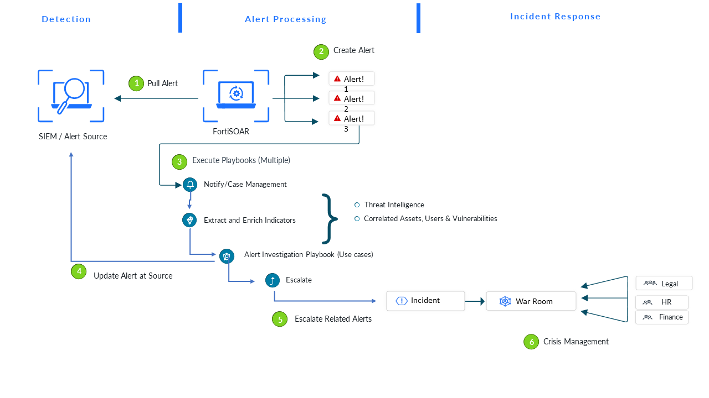

# Release Information

# Overview 

SOAR Framework **Solution Pack** (SFSP) lays the foundation to use the FortiSOAR platform optimally for Incident response and automation use cases in a Security Operations Center (SOC).  

## How does this Solution Pack work for you?

SFSP installs several modules such as alerts, incidents, and indicators along with corresponding playbooks, dashboards, reports, and widgets to make it a comprehensive solution and provide a fully functional Incident Response Platform augmented by Automation and Threat Intelligence. 

## Advantages of SOAR Framework Solution Pack 

Some key benefits of SOAR Framework SP: 

* Provides standardized modules for various operations in a SOC – e.g. alerts, incidents, indicators, campaigns, and hunts
* Helps establish and follow a standardized process through playbooks for indicator extraction, enrichment, and mitigation
* Standardized dashboards and reports around several key performance indicators of SOC help better monitor the setup
* Helps build various other solution packs on top of SFSP thereby extending the system in a standardized way for various use cases, through an included framework

## Overall Design 

Let us begin with understanding the overall design/process of receiving the alerts (from various sources such as SIEM) and responding to them efficiently using automated playbooks. During the process, we will also learn about several pre-built modules, playbooks, integrations, and dashboards/reports to manage the overall SOC efficiently.  

### Information Flow

The FortiSOAR process happens in multiple steps starting from ingestion of alerts, extraction and enrichment of indicators, execution of multiple playbooks to assign various degrees of urgency to alerts received, and culminating in the alert’s investigation to conclude if the given alert is a false positive or true positive. 

In case of a true positive, the SOC escalates related alerts into an incident, leveraging crisis management using war rooms and several other utilities, to respond to the incident. 

The following diagram helps better understand the overall process and the subsequent explanations.

**Pull alerts from the data source** - FortiSOAR, at regular intervals, pulls alerts from configured alert sources such as SIEM, EDR, or email. This process is the Alert Ingestion and it creates the alert records in the system. 

After the alert is created, multiple playbooks (see following list) are launched to achieve intended objectives. As part of Alert Ingestion, corresponding fields are mapped into target Alert Module. Refer to [Extending Default Alert Schema](docs/extending-default-alert-schema.md) for additional details. 

1. **Extract indicators**– For each newly created alert, FortiSOAR executes a playbook named “**Extract Indicators**”.This playbook creates **Indicator** records for the known fields of interest.
2. **Enrich Indicators** – After creating an indicator record, FortiSOAR triggers a playbook such as “**Indicator (TypeDomain) – Get Reputation**” to gather desired context (aka Enrichment) and to compute the reputation of the given indicator. Enrichment happens from various sources, e.g. SIEM or EDR correlation, indicator enrichment from available open-source intelligence, and users’ details enrichment from Active Directory®. For additional details, refer to [Extending Default Indicator Enrichment Process](#extending-default-indicator-enrichment-process) section. 
3. **Triage** - Triaging is the identification of the criticality of data and assets, the severity of the incident, deciding containment strategies, following the escalation matrix, and then acting on the defined isolation and blocking strategies. Suppose there are multiple alerts received, signifying an incident –a threat actor is attempting to gain access to two computers (assets) in your network; one of the assets is an endpoint with sensitive data and the other is a decoy. In this case, while triaging, you assign higher priority to the endpoint with sensitive data. 
4. **Action** - After a successful triage, playbooks help take corrective action on the triaged indicators. Actions may include asset mitigation by isolation, blocking domains and URLs through firewalls, and blocking or disabling users and IP addresses. For additional details, refer to [Action Playbook Collection](#actions-playbook-collection).
5. **Hunt** - Hunt playbooks search and identify suspicious domains, malware, files, or other indicators and create alerts as and when such threats are located. 
6. **Case Management** - Case Management automates processes like adding users as case owners, tracking SLA and resolution timelines, among other things, using playbooks. It also contains playbooks that resolve an alert by taking appropriate action or marking it as an **incident** and escalating it. 
7. **Incident Response** - These playbooks help plan a response to an incident like a malware attack.

After the completion of Indicator extraction and enrichment, the alert is ready for further investigation. This state is internally identified as `state=ready to investigate`. Here, some playbooks trigger to respond to a specific type of alert. These are termed as **Use Case Playbooks**. The playbook collection named “**02 – Use Cases**” contains multiple such response playbooks. Alternatively, some SPs will deploy their respective response playbooks in a collection named as `02 - Use Case - <intent>`. For example **02- Use Case - Brute Force Attack** which contain playbooks for responding to Brute Force Attack alerts.

At the end of this cycle, the given alert is either marked as **False Positive** and **closed** or marked as **True Positive** and **Escalated into an Incident**. Note, the Escalation into an incident by default is a manual step (by clicking **Escalate** button), but the same can also be automated via invoking **Escalate to Incident Playbook** into the respective response playbooks. 

Marking an alert as **Closed** invokes a corresponding [close source alert](docs/contents.md#06---irp---case-management) playbook. This playbook, by default, simply prompts you to close the alert at the source; however, you must modify that to use the respective product's connectors (such as FortiSIEM) to invoke the closure action. This way you can update the source systems to your desired state.

## Additional Resources 

* [Extending Default Alert Schema](docs/extending-default-alert-schema.md)
* [Configuring Alert Ingestion Process](docs/configuring-alert-Ingestion-process.md)
* [Extending Default Indicator Extraction Process](docs/extending-default-indicator-extraction-process.md)
* [Extending Default Indicator Enrichment Process](docs/extending-default-indicator-enrichment-process.md)
* [Tutorial: Building Investigation/Response Playbook](docs/building-investigation-response-playbook.md)
* [Setting up Default Mitigation Playbooks](docs/setting-up-default-mitigation-playbook.md)
* [Setting up Default Hunt Playbooks](docs/setting-up-default-hunt-playbook.md)

## Next Steps

| [Installation](docs/setup.md#installation) | [Configuration](docs/setup.md#configuration) | [Usage](docs/usage.md) | [Contents](docs/contents.md) |
|--------------------------------------------|----------------------------------------------|------------------------|------------------------------|
