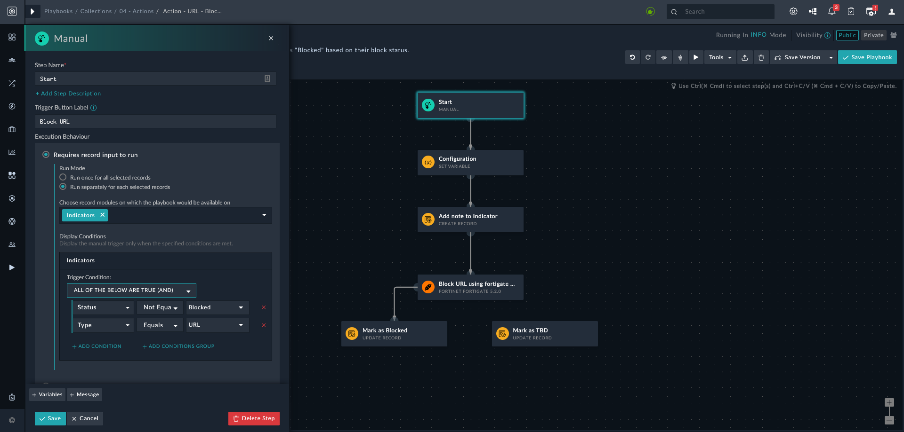
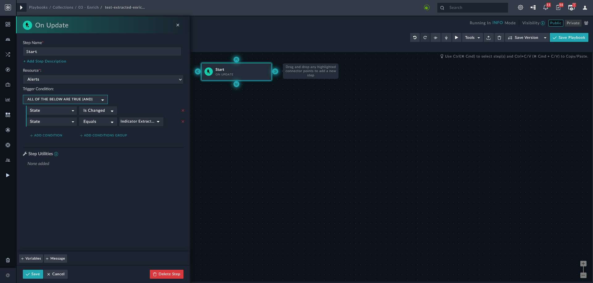
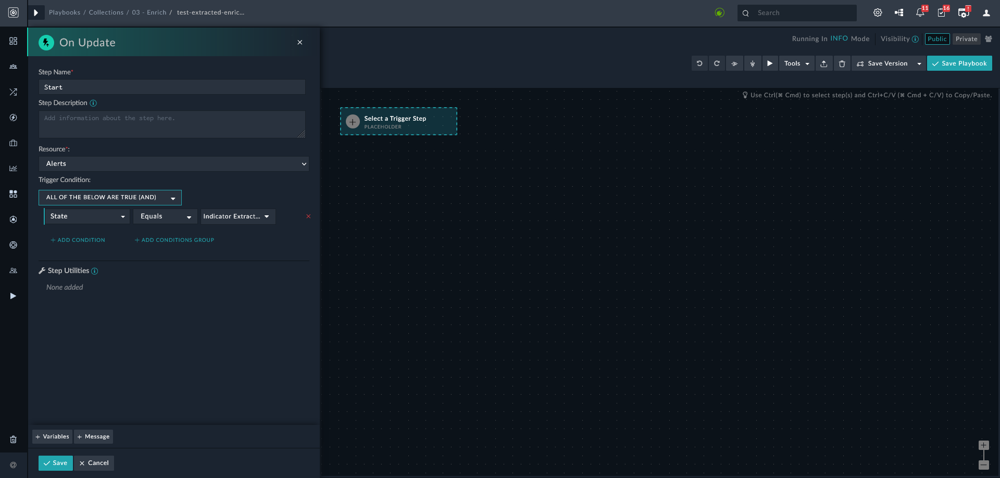
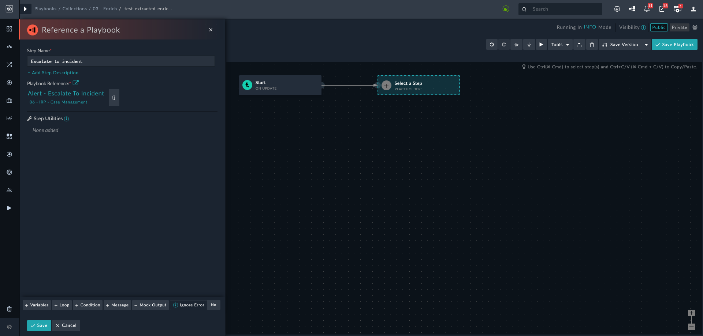

# Building Investigation/Response Playbook

Playbooks in FortiSOAR help you automate your security processes across external systems while respecting the business process required for your organization to function. Playbook templates can be customized to follow an organization's current procedures while leveraging the automation capabilities of FortiSOAR.

You can build specific playbooks that help you in investigation or respond to various threats. Following pointers must be noted when creating investigation/response playbooks:

* Decide how you want to trigger your playbook &ndash; manually, or automatically for a certain alert type.
    * **Manual Trigger** - To create a manual trigger for a playbook, specify the condition when this playbook becomes visible &ndash; is available as one of the actions on the indicator page after clicking **Execute**. E.g. the following screen shows that the playbook becomes visible when following conditions are met:
    
        >Indicator *Type* is *URL*  
        >*Status* is not *Blocked*.

        

    * **Automatic Trigger** - Intuitively, you may use *Post Create* as a trigger; as part of SFSP there is are playbooks that ensure indicator extraction.

        >Post update, State changed     
        >State = Indicator Extracted

        

* Investigation/Response playbooks should typically be executed, once indicator extraction and enrichment is complete. Hence, a response playbook's trigger should be set to

    ```
    On Update , State = Indicator Extracted
    ```
    

    This step ensures that your investigation/response playbook is executed only after indicators are extracted and enriched.

    >**NOTE**: that there exists an escalation playbook that escalates an alert to an incident. You may want to reference that playbook instead of creating a new playbook that performs the same actions.

    >


<!-- ## Building an Investigation Playbook

Each threat investigation differs from the next and automating an investigation, through playbooks, is crucial for timely response to threats.

This section helps create a playbook that identifies and investigates phishing attacks, as an example. The instructions may help you take the required action to protect information and minimize risks.

1. Configure connectors for your security solutions. [The FortiSOAR connector page](https://docs.fortinet.com/fortisoar/connectors) contains the list of all the connectors for major security solutions. Select any connector for detailed instructions for configuring that connector.

2. Configure an [alert ingestion process](./configuring-alert-Ingestion-process.md). For demo purposes, you can manually create indicators that FortiSOAR runs through its system to enrich indicator data.

    >**TIP**: Click **Incident Response** > **Indicators** and on the **Indicators** page, click **+ Add Indicator**; to create an indicator manually.

3. Create an investigation playbook.
    1. Log in to FortiSOAR and navigate to **Automation** > **Playbooks**.
    2. On the **Playbook Collections** tab, click **+ New Collection** and in the **Add New Playbook Collection** dialog, add a name for the new playbook collection.
    3. Click **Add Playbook** to add a new playbook to the collection you just created. Type a name for the new playbook. This action launches the playbook designer.
    4. Specify a trigger for this playbook. Refer to [Triggers and Steps](https://docs.fortinet.com/document/fortisoar/7.2.0/playbooks-guide/784146/triggers-steps) section to understand the various triggers that you can set for this playbook.
    5. Add steps to the playbook. You can also use [dynamic variables](https://docs.fortinet.com/document/fortisoar/7.2.0/playbooks-guide/953224/dynamic-variables) and [dynamic values](https://docs.fortinet.com/document/fortisoar/7.2.0/playbooks-guide/488685/dynamic-values) to avoid hard-coding data.
    6. Add a Decision step to determine if the indicator is malicious.
        >**TIP**: Add the decision step first and the conditions after adding other steps &dash; makes creating conditions for the decision step easier.
    7. In the steps *after* the decision step, update the alert record as per the input received from connectors. To create steps that update records and perform many other actions, refer to [creating playbook steps](https://docs.fortinet.com/document/fortisoar/7.2.0/playbooks-guide/784146/triggers-steps#Playbook_Steps_..5).
    8. Return to decision step and add conditions as per the steps created. To learn about adding conditions to a decision step, refer to [evaluating trigger steps](https://docs.fortinet.com/document/fortisoar/7.2.0/playbooks-guide/784146/triggers-steps#Evaluate).
    9. Ensure that the playbook is active. If not, click the **Inactive** button to activate the playbook.

You can also follow the [creating a sample playbook tutorial](https://docs.fortinet.com/document/fortisoar/7.0.2/playbooks-guide/83828/tutorial-creating-a-sample-playbook-to-determine-maliciousness-of-an-indicator-in-fortisoar) to better acquaint yourself with the process.

## Building a Response Playbook

Response playbooks should typically be executed, once indicator extraction and enrichment is complete. Hence, a response playbook's trigger should be set to 
>`On Update , State = Indicator Extracted`

-->