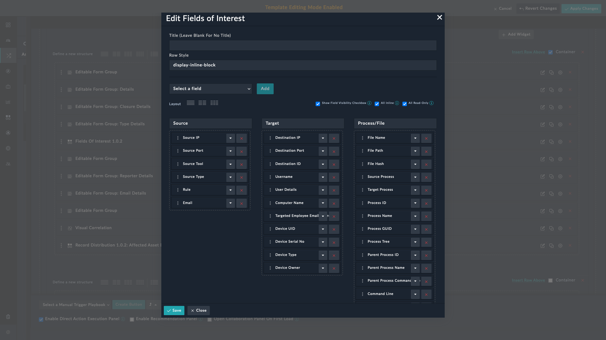

| [Home](../README.md) |
|----------------------|

# Extending Default Alert Schema

By default, the **Alert** module has a default alert schema that has provisions for well-known fields of interest. For example, fields such as **Source IP**, **Destination IP**, and **File hash** are already part of the [default schema](#default-alert-schema).

As part of the alert ingestion process, you may need to add additional fields. Following is a sample process to achieve this objective.

1. Add a desired field to the **Alerts** module. For detailed instructions to achieve this objective, refer to [Modifying an existing module](https://docs.fortinet.com/document/fortisoar/7.0.2/administration-guide/97786/application-editor#Modifying_an_existing_module).
    > As an example, let us add a field with **Field Title** as `Targeted Employee Email Address`, **Field API key** as `targetedEmployeeEmailAddress` and **Field Type** as `Email Field`.

2. Add the field in alert details.
    <ol type="a">
    <li>Log on to FortiSOAR using your credentials.</li>
    <li>Click <strong>Incident Response</strong> > <strong>Alerts</strong> in the left-navigation to open the <strong>Alerts</strong> module in the list view.</li>
    <li>Click an alert to open the detailed view.</li>
    <li>Click the <strong>Edit Template</strong> icon on the top right.</li>
    
    <li>Navigate to <strong>Fields Of Interest</strong> under <strong>Tabs</strong> > <strong>Alert Details</strong>. To know more about the fields of interest widget, refer to <a href="https://fortisoar.contenthub.fortinet.com//list.html?contentType=all&searchContent=fields%20of%20interest">Fields of Interest</a> widget on Content Hub.</li>
    <li>Click the <strong>Edit</strong> icon  to edit it.</li>
    
    <li>From the drop-down, select the field that you added &ndash; <code>Targeted Employee Email Address</code> &ndash; and click <strong>Add</strong>.</li>
    <li>Click <strong>Save</strong> to have <code>Targeted Employee Email Address</code> appear in the <strong>Alerts Details</strong> section.</li>
    </ol>
4. Map this field appropriately in the **Data Ingestion** process. Refer to [Data Ingestion Wizard](https://docs.fortinet.com/document/fortisoar/7.2.0/connectors-guide/682058/data-ingestion#Data_Ingestion_Wizard) for details.

5. To extract this field as an indicator, refer to [extending indicator extraction process](./extending-default-indicator-extraction-process.md).

# Default Alert Schema

| #   | Field Title                     | Field API Key  Name     | Type            |
|-----|---------------------------------|-------------------------|-----------------|
| 1   | Ticket ID                       | `ticketID`              | `string`        |
| 2   | Rule                            | `rule`                  | `string`        |
| 3   | IP Addresses                    | `iPAddresses`           | `object`        |
| 4   | File Hashes                     | `fileHashes`            | `object`        |
| 5   | Resolved Automatedly            | `resolvedAutomatedly`   | `boolean`       |
| 6   | Destination ID                  | `destinationID`         | `string`        |
| 7   | Vulnerability Severity          | `vulnerabilitySeverity` | `integer`       |
| 8   | Ack SLA Paused Date             | `ackSLApausedon`        | `integer`       |
| 9   | Campaigns                       | `campaigns`             | `campaigns`     |
| 10  | Detection Date                  | `alertDetectionDate`    | `integer`       |
| 11  | Response SLA Paused Date        | `respSLApausedon`       | `integer`       |
| 12  | Response Date                   | `respDate`              | `integer`       |
| 13  | Ack Date                        | `ackDate`               | `integer`       |
| 14  | Name                            | `name`                  | `string`        |
| 15  | Assets                          | `assets`                | `assets`        |
| 16  | Computer Name                   | `computerName`          | `string`        |
| 17  | Alerts                          | `alerts`                | `alerts`        |
| 18  | Assigned To                     | `assignedTo`            | `people`        |
| 19  | Events                          | `events`                | `events`        |
| 20  | Source Data                     | `sourcedata`            | `string`        |
| 21  | Companies                       | `companies`             | `companies`     |
| 22  | Ack Due Date                    | `dueBy`                 | `integer`       |
| 23  | Username                        | `userName`              | `string`        |
| 24  | Task                            | `tasks`                 | `tasks`         |
| 25  | User Details                    | `userDetails`           | `string`        |
| 26  | Status                          | `status`                | `picklists`     |
| 27  | Target Asset                    | `targetAsset`           | `string`        |
| 28  | Target Process                  | `targetProcess`         | `string`        |
| 29  | Severity                        | `severity`              | `picklists`     |
| 30  | Attachments                     | `attachments`           | `attachments`   |
| 31  | Attachment Names                | `attachmentNames`       | `string`        |
| 32  | Bytes Transferred               | `bytesTransferred`      | `string`        |
| 33  | Command Line                    | `commandLine`           | `string`        |
| 34  | Comments                        | `comments`              | `comments`      |
| 35  | Decoded Command Line            | `decodedCommandLine`    | `string`        |
| 36  | Description                     | `description`           | `string`        |
| 37  | Hunts                           | `hunts`                 | `hunt`          |
| 38  | Destination IP                  | `destinationIp`         | `string`        |
| 39  | Device UID                      | `deviceUID`             | `string`        |
| 40  | Domain                          | `domain`                | `string`        |
| 41  | Epoch Time                      | `epochTime`             | `string`        |
| 42  | Event Time                      | `eventTime`             | `string`        |
| 43  | Incidents                       | `incidents`             | `incidents`     |
| 44  | Destination Port                | `destinationPort`       | `string`        |
| 45  | Email Classification            | `emailClassification`   | `picklists`     |
| 46  | Remaining Response SLA on Pause | `alertRemainingRespSLA` | `integer`       |
| 47  | Remaining Ack SLA on Pause      | `alertRemainingAckSLA`  | `integer`       |
| 48  | Device Serial No                | `deviceSerialNo`        | `string`        |
| 49  | Device Owner                    | `deviceOwner`           | `string`        |
| 50  | Device Type                     | `deviceType`            | `picklists`     |
| 51  | Ack SLA                         | `ackSlaStatus`          | `picklists`     |
| 52  | Assigned Date                   | `assigneddate`          | `integer`       |
| 53  | Indicators                      | `indicators`            | `indicators`    |
| 54  | Resolved Date                   | `resolveddate`          | `integer`       |
| 55  | Response SLA                    | `respSlaStatus`         | `picklists`     |
| 56  | Closure Notes                   | `closureNotes`          | `string`        |
| 57  | URL                             | `url`                   | `string`        |
| 58  | Scheduled Task                  | `scheduledTask`         | `string`        |
| 59  | Type                            | `type`                  | `picklists`     |
| 60  | Priority Weight                 | `priorityWeight`        | `integer`       |
| 61  | Bucket Name                     | `bucketName`            | `string`        |
| 62  | File Names                      | `fileNames`             | `string`        |
| 63  | Escalated                       | `escalatedtoincident`   | `picklists`     |
| 64  | Escalation Reason               | `escalationReason`      | `string`        |
| 65  | Communications                  | `communications`        | `communication` |
| 66  | Process GUID                    | `processGuid`           | `string`        |
| 67  | Process ID                      | `processId`             | `string`        |
| 68  | Source ID                       | `sourceId`              | `string`        |
| 69  | File Path                       | `filePath`              | `string`        |
| 70  | Parent Process Command Line     | `parentProcessCmdLine`  | `string`        |
| 71  | File Hash                       | `fileHash`              | `string`        |
| 72  | File Name                       | `fileName`              | `string`        |
| 73  | Kill Chain Phase                | `killChainPhase`        | `picklists`     |
| 74  | Latest Login                    | `latestLogin`           | `string`        |
| 75  | Metrics                         | `metrics`               | `string`        |
| 76  | Parent Process ID               | `parentProcessPid`      | `string`        |
| 77  | Parent Process Name             | `parentProcessName`     | `string`        |
| 78  | People                          | `persons`               | `people`        |
| 79  | Process Name                    | `processName`           | `string`        |
| 80  | Process Tree                    | `processTree`           | `string`        |
| 81  | Response Due Date               | `respDueDate`           | `integer`       |
| 82  | Registry Key                    | `registryKey`           | `string`        |
| 83  | Registry Key Value              | `registryKeyValue`      | `string`        |
| 84  | Service                         | `services`              | `string`        |
| 85  | Source                          | `source`                | `string`        |
| 86  | Source IP                       | `sourceIp`              | `string`        |
| 87  | Source Port                     | `sourcePort`            | `string`        |
| 88  | Source Process                  | `sourceProcess`         | `string`        |
| 89  | Source Tool                     | `sourceTool`            | `string`        |
| 90  | Return Path                     | `returnPath`            | `string`        |
| 91  | State                           | `state`                 | `picklists`     |
| 92  | Source Type                     | `sourceType`            | `string`        |
| 93  | War Rooms                       | `warrooms`              | `warrooms`      |
| 94  | Closure Reason                  | `closureReason`         | `picklists`     |
| 95  | Email From                      | `emailFrom`             | `string`        |
| 96  | Reporter Email Body             | `reporterEmailBody`     | `string`        |
| 97  | Reporter                        | `reporter`              | `string`        |
| 98  | Sender Domain                   | `senderDomain`          | `string`        |
| 99  | Email Body                      | `emailBody`             | `string`        |
| 100 | Email Recipients (To)           | `emailTo`               | `string`        |
| 101 | Recipient Email Address         | `recipientEmailAddress` | `string`        |
| 102 | Email Headers                   | `emailHeaders`          | `string`        |
| 103 | Sender Email Address            | `senderEmailAddress`    | `string`        |
| 104 | Email Subject                   | `emailSubject`          | `string`        |
| 105 | UUID                            | `uuid`                  | `string`        |
| 106 | Email                           | `fileEmail`             | `string`        |
| 107 | Technique ID                    | `mitreattackid`         | `string`        |
| 108 | Technique                       | `mitreTechnique`        | `string`        |

| [Installation](./setup.md#installation) | [Configuration](./setup.md#configuration) | [Usage](./usage.md) | [Contents](./contents.md) |
|-----------------------------------------|-------------------------------------------|---------------------|---------------------------|
