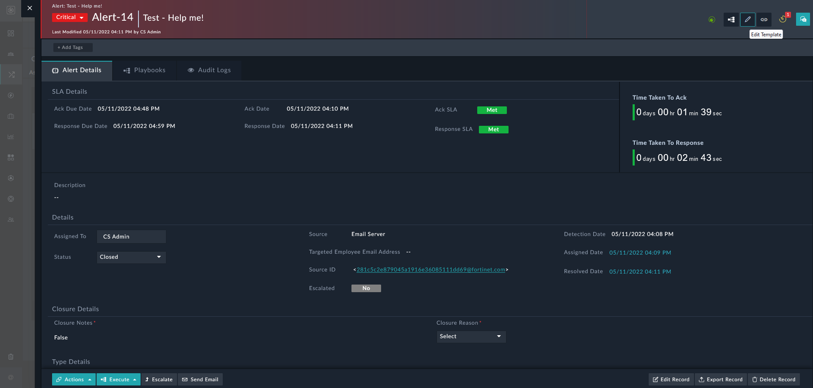
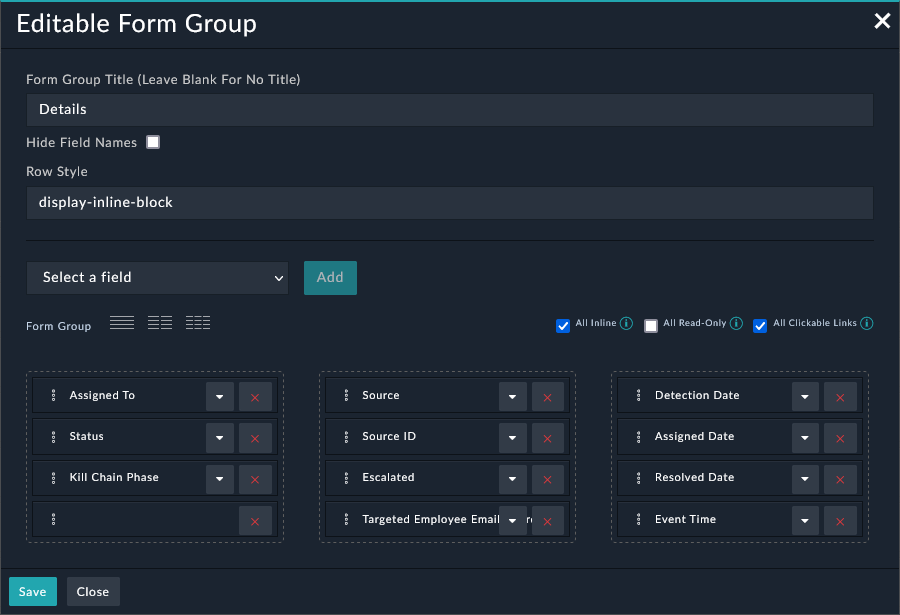

| [Home](../README.md) |
|----------------------|

# Extending Default Alert Schema

By default, the **Alert** module has a default alert schema that has provisions for well-known fields of interest. For example, fields such as **Source IP**, **Destination IP**, and **File hash** are already part of the [default schema](#default-alert-schema).

As part of the alert ingestion process, you may need to add additional fields. Following is a sample process to achieve this objective.

1. Add a desired field to the **Alerts** module. For detailed instructions to achieve this objective, refer to [Modifying an existing module](https://docs.fortinet.com/document/fortisoar/7.0.2/administration-guide/97786/application-editor#Modifying_an_existing_module).
    > As an example, let us add a field with **Field Title** as `Targeted Employee Email Address`, **Field API key** as `targetedEmployeeEmailAddress` and **Field Type** as `Email Field`.

2. Add the field in alert details.
    <ol type="a">
    <li>Log on to FortiSOAR using your credentials.</li>
    <li>Click <strong>Incident Response</strong> > <strong>Alerts</strong> in the left-navigation to open the <strong>Alerts</strong> module in the list view.</li>
    <li>Click an alert to open the detailed view.</li>
    <li>Click the <strong>Edit Template</strong> icon on the top right.</li>
    
    <li>Navigate to <strong>Editable Form Group: Details</strong> under <strong>Tabs</strong> > <strong>Alert Details</strong>.</li>
    <li>Click the <strong>Edit</strong> icon to edit it.</li>
    
    <li>From the drop-down, select the field that you added &ndash; <code>Targeted Employee Email Address</code> &ndash; and click <strong>Add</strong>.</li>
    <li>Click <strong>Save</strong> to have <code>Targeted Employee Email Address</code> appear in the <strong>Alerts Details</strong> section.</li>
    </ol>
3. Set the new column &ndash; `Targeted Employee Email Address` &ndash; visible.
    <ol type="a">
    <li>Click the hamburger menu on the right.</li>
    <li>Scroll down to locate <code>Targeted Employee Email Address</code> and select it to make it visible.</li>
    <blockquote>All <strong>visible</strong> fields appear with a green check mark.</blockquote>
    <li>The field &ndash; <code>Targeted Employee Email Address</code> &ndash; appears as one of the columns. You can drag and drop to rearrange it as per your preference.</li>
    </ol>
4. Map this field appropriately in the **Alert Ingestion** process. Refer to [Data Ingestion Wizard](https://docs.fortinet.com/document/fortisoar/7.2.0/connectors-guide/682058/data-ingestion#Data_Ingestion_Wizard) for details.
5. To extract this field as an indicator, refer to [extending indicator extraction process](./extending-default-indicator-extraction-process.md).

# Default Alert Schema

|  S. No | Field Title                      | Field API Key  Name     | Type           |
| -------|----------------------------------|-------------------------|----------------|
|1| Ack Date                         | `ackDate`                    | `Datetime`          |
|2| Ack Due Date                     | `dueBy`                      | `Datetime`          |
|3| Ack SLA                          | `ackSlaStatus`               | `Picklist`          |
|4| Ack SLA Paused  Date             | `ackSLApausedon`             | `Datetime`          |
|5| Alerts                           | `alerts`                     | `Many To Many`      |
|6| Assets                           | `assets`                     | `Many To Many`      |
|7| Assigned Date                    | `assigneddate`               | `Datetime`          |
|8| Assigned To                      | `assignedTo`                 | `Lookup`            |
|9| Attachment  Names                | `attachmentNames`            | `Text`              |
|10| Attachments                      | `attachments`                | `Many To Many`      |
|11| Bucket Name                      | `bucketName`                 | `Text`              |
|12| Bytes  Transferred               | `bytesTransferred`           | `Text`              |
|13| Campaigns                        | `campaigns`                  | `Many To Many`      |
|14| Closure Notes                    | `closureNotes`               | `Richtext`          |
|15| Closure Reason                   | `closureReason`              | `Picklist`          |
|16| Command Line                     | `commandLine`                | `Text`              |
|17| Comments                         | `comments`                   | `Many To Many`      |
|18| Communications                   | `communications`             | `Many To Many`      |
|19| Companies                        | `companies`                  | `Many To Many`      |
|20| Computer Name                    | `computerName`               | `Text`              |
|21| Decoded  Command Line            | `decodedCommandLine`         | `Text`              |
|22| Description                      | `description`                | `Richtext`          |
|23| Destination  Port                | `destinationPort`            | `Text`              |
|24| Destination ID                   | `destinationID`              | `Text`              |
|25| Destination IP                   | `destinationIp`              | `Text`              |
|26| Detection Date                   | `alertDetectionDate`         | `Datetime`          |
|27| Device Owner                     | `deviceOwner`                | `Text`              |
|28| Device Serial  No                | `deviceSerialNo`             | `Text`              |
|29| Device Type                      | `deviceType`                 | `Picklist`          |
|30| Device UID                       | `deviceUID`                  | `Text`              |
|31| Domain                           | `domain`                     | `Text`              |
|32| Email                            | `fileEmail`                  | `File`              |
|33| Email  Classification            | `emailClassification`        | `Picklist`          |
|34| Email  Recipients (To)           | `emailTo`                    | `Text`              |
|35| Email Body                       | `emailBody`                  | `Richtext`          |
|36| Email From                       | `emailFrom`                  | `Email`             |
|37| Email Headers                    | `emailHeaders`               | `Textarea`          |
|38| Email Subject                    | `emailSubject`               | `Text`              |
|39| Epoch Time                       | `epochTime`                  | `Text`              |
|40| Escalated                        | `escalatedtoincident`        | `Picklist`          |
|41| Escalation  Reason               | `escalationReason`           | `Richtext`          |
|42| Event Time                       | `eventTime`                  | `Text`              |
|43| Events                           | `events`                     | `One To Many`       |
|44| File Hash                        | `fileHash`                   | `Text`              |
|45| File Hashes                      | `fileHashes`                 | `JSON`              |
|46| File Name                        | `fileName`                   | `Text`              |
|47| File Names                       | `fileNames`                  | `Textarea`          |
|48| File Path                        | `filePath`                   | `Text`              |
|49| Hunts                            | `hunts`                      | `Many To Many`      |
|50| Incidents                        | `incidents`                  | `Many To Many`      |
|51| Indicators                       | `indicators`                 | `Many To Many`      |
|52| IP Addresses                     | `iPAddresses`                | `JSON`              |
|53| Kill Chain  Phase                | `killChainPhase`             | `Picklist`          |
|54| Latest Login                     | `latestLogin`                | `Text`              |
|55| Metrics                          | `metrics`                    | `Richtext`          |
|56| MITRE  ATT&CK ID                 | `mitreattackid`              | `Text`              |
|57| MITRE  Technique                 | `mitreTechnique`             | `Text`              |
|58| Name                             | `name`                       | `Text`              |
|59| Parent Process  Command Line     | `parentProcessCmdLine`       | `Text`              |
|60| Parent Process  ID               | `parentProcessPid`           | `Text`              |
|61| Parent Process  Name             | `parentProcessName`          | `Text`              |
|62| People                           | `persons`                    | `Many To Many`      |
|63| Priority  Weight                 | `priorityWeight`             | `Integer`           |
|64| Process GUID                     | `processGuid`                | `Text`              |
|65| Process ID                       | `processId`                  | `Text`              |
|66| Process Name                     | `processName`                | `Text`              |
|67| Process Tree                     | `processTree`                | `Text`              |
|68| Recipient Email  Address         | `recipientEmailAddress`      | `Textarea`          |
|69| Registry Key                     | `registryKey`                | `Text`              |
|70| Registry Key  Value              | `registryKeyValue`           | `Text`              |
|71| Remaining  Response SLA on Pause | `alertRemainingRespSLA`      | `Integer`           |
|72| Remaining Ack  SLA on Pause      | `alertRemainingAckSLA`       | `Integer`           |
|73| Reporter                         | `reporter`                   | `Text`              |
|74| Reporter Email  Body             | `reporterEmailBody`          | `Richtext`          |
|75| Resolved Automatedly             | `resolvedAutomatedly`        | `Checkbox`          |
|76| Resolved Date                    | `resolveddate`               | `Datetime`          |
|77| Response Date                    | `respDate`                   | `Datetime`          |
|78| Response Due  Date               | `respDueDate`                | `Datetime`          |
|79| Response SLA                     | `respSlaStatus`              | `Picklist`          |
|80| Response SLA  Paused Date        | `respSLApausedon`            | `Datetime`          |
|81| Return Path                      | `returnPath`                 | `Text`              |
|82| Scheduled Task                   | `scheduledTask`              | `Text`              |
|83| Sender Domain                    | `senderDomain`               | `Text`              |
|84| Sender Email  Address            | `senderEmailAddress`         | `Text`              |
|85| Service                          | `services`                   | `Text`              |
|86| Severity                         | `severity`                   | `Picklist`          |
|87| Source                           | `source`                     | `Text`              |
|88| Source Data                      | `sourcedata`                 | `Textarea`          |
|89| Source ID                        | `sourceId`                   | `Text`              |
|90| Source IP                        | `sourceIp`                   | `Text`              |
|91| Source Port                      | `sourcePort`                 | `Text`              |
|92| Source Process                   | `sourceProcess`              | `Text`              |
|93| Source Tool                      | `sourceTool`                 | `Text`              |
|94| Source Type                      | `sourceType`                 | `Text`              |
|95| State                            | `state`                      | `picklist`          |
|96| Status                           | `status`                     | `Picklist`          |
|97| Target Asset                     | `targetAsset`                | `Text`              |
|98| Target Process                   | `targetProcess`              | `Text`              |
|99| Task                             | `tasks`                      | `Many To Many`      |
|100| Ticket ID                        | `ticketID`                   | `Text`              |
|101| Type                             | `type`                       | `Picklist`          |
|102| URL                              | `url`                        | `Text`              |
|103| User Details                     | `userDetails`                | `Text`              |
|104| Username                         | `userName`                   | `Text`              |
|105| UUID                             | `uuid`                       |                |
|106| Vulnerability  Severity          | `vulnerabilitySeverity`      | `Integer`           |
|107| War Rooms                        | `warrooms`                   | `Many To Many`      |

| [Installation](./setup.md#installation) | [Configuration](./setup.md#configuration) | [Usage](./usage.md) | [Contents](./contents.md) |
|-----------------------------------------|-------------------------------------------|---------------------|---------------------------|
