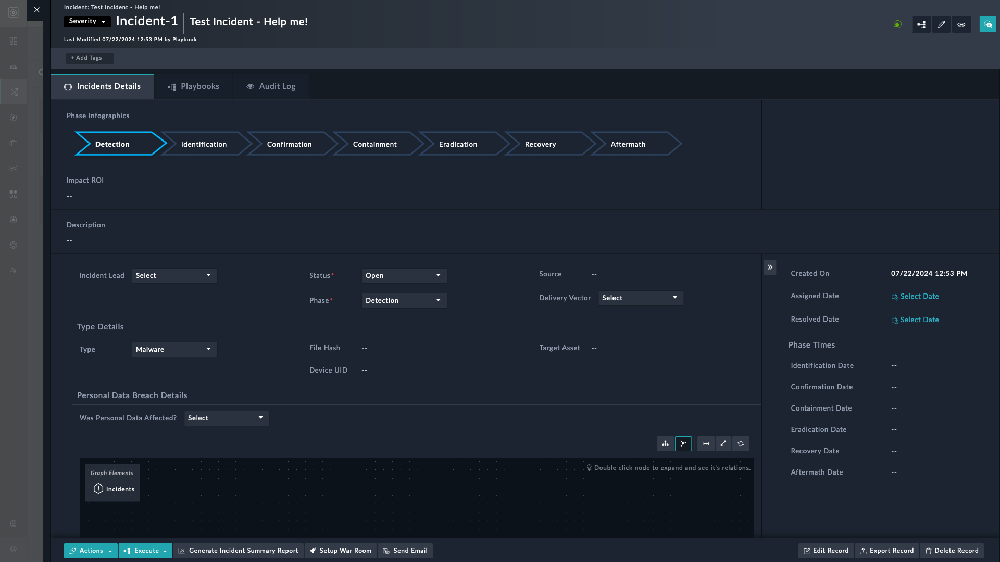
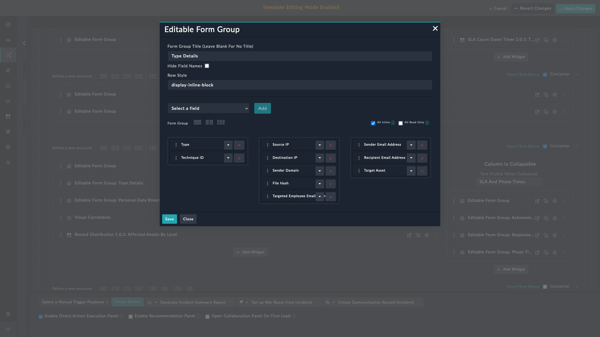

| [Home](../README.md) |
|----------------------|

# Extending Default Incident Schema

By default, the **Incidents** module has a default incident schema that has provisions for well-known fields of interest. For example, fields such as **Source IP**, **Destination IP**, and **File hash** are already part of the [default schema](#default-incident-schema).

As part of the ingestion process, you may need to add additional fields. Following is a sample process to achieve this objective.

1. Add a desired field to the **Incidents** module. For detailed instructions to achieve this objective, refer to [Modifying an existing module](https://docs.fortinet.com/document/fortisoar/7.5.0/administration-guide/97786#Modifying_an_existing_module) in the FortiSOAR Administration Guide.

    > As an example, let us add a field with **Field Title** as `Targeted Employee Email Address`, **Field API key** as `targetedEmployeeEmailAddress` and **Field Type** as `Email Field`.

2. Add the field in incident details.
    <ol>
        <li>Log on to FortiSOAR using your credentials.</li>
        <li>Click <strong>Incident Response</strong> > <strong>Incidents</strong> in the left-navigation to open the <strong>Incidents</strong> module in the list view.</li>
        <li>Click an incident to open the detailed view.</li>
        <li>Click the <strong>Edit Template</strong> icon  on the top right.</li>
        
        <li>Navigate to <strong>Editable Form Group: Type Details</strong> under <strong>Tabs</strong> > <strong>Incident Details</strong>.</li>
        <li>Click the <strong>Edit</strong> icon  to edit it.</li>
        
        <li>From the drop-down, select the field that you added &ndash; <code>Targeted Employee Email Address</code> &ndash; and click <strong>Add</strong>.</li>
        <li>Click <strong>Save</strong> to have <code>Targeted Employee Email Address</code> appear in the <strong>Incidents Details</strong> section.</li>
    </ol>

3. Set the new column &ndash; `Targeted Employee Email Address` &ndash; visible.
    <ol type="a">
    <li>Click the hamburger menu on the right.</li>
    <li>Scroll down to locate <code>Targeted Employee Email Address</code> and select it to make it visible.</li>
    <blockquote>All <strong>visible</strong> fields appear with a green check mark.</blockquote>
    <li>The field &ndash; <code>Targeted Employee Email Address</code> &ndash; appears as one of the columns. You can drag and drop to rearrange it as per your preference.</li>
    </ol>
4. Map this field appropriately in the **Data Ingestion** process. Refer to [Data Ingestion Wizard](https://docs.fortinet.com/document/fortisoar/7.2.0/connectors-guide/682058/data-ingestion#Data_Ingestion_Wizard) for details.

5. To extract this field as an indicator, refer to [extending indicator extraction process](./extending-default-indicator-extraction-process.md).

# Default Incident Schema

| #  | Field Title                     | Field API Key  Name       | Type            |
|----|---------------------------------|---------------------------|-----------------|
| 1  | State                           | `state`                   | `picklists`     |
| 2  | Escalated                       | `escalated`               | `picklists`     |
| 3  | Ticket ID                       | `ticketID`                | `string`        |
| 4  | Impact ROI                      | `impactROI`               | `integer`       |
| 5  | Was personal data affected?     | `wasPersonalDataAffected` | `picklists`     |
| 6  | War Rooms                       | `warrooms`                | `warrooms`      |
| 7  | Remaining Response SLA on Pause | `incRemainingRespSLA`     | `integer`       |
| 8  | Remaining Ack SLA on Pause      | `incRemainingAckSLA`      | `integer`       |
| 9  | Response SLA Paused Date        | `respSLApausedon`         | `integer`       |
| 10 | Ack SLA Paused Date             | `ackSLApausedon`          | `integer`       |
| 11 | Volatile Data                   | `volatileData`            | `string`        |
| 12 | Business Impact                 | `businessImpact`          | `string`        |
| 13 | Comments                        | `comments`                | `comments`      |
| 14 | Companies                       | `companies`               | `companies`     |
| 15 | Confirmation Date               | `confirmationDate`        | `integer`       |
| 16 | Sender Email Address            | `senderEmailAddress`      | `string`        |
| 17 | Eradication Date                | `eradicationDate`         | `integer`       |
| 18 | File Hash                       | `filehash`                | `string`        |
| 19 | Identification Date             | `identificationDate`      | `integer`       |
| 20 | Impact Assessments              | `impactAssessments`       | `string`        |
| 21 | Incident Lead                   | `incidentLead`            | `people`        |
| 22 | Incident Summary                | `incidentsummary`         | `string`        |
| 23 | Indicators                      | `indicators`              | `indicators`    |
| 24 | Metrics                         | `metrics`                 | `string`        |
| 25 | Next Steps                      | `nextsteps`               | `string`        |
| 26 | People                          | `persons`                 | `people`        |
| 27 | Phase                           | `phase`                   | `picklists`     |
| 28 | Phase Infographics              | `incidentphase`           | `string`        |
| 29 | Recovery Date                   | `recoveryDate`            | `integer`       |
| 30 | Response Date                   | `resDate`                 | `integer`       |
| 31 | Response Due Date               | `resDueBy`                | `integer`       |
| 32 | Recipient Email Address         | `receipientEmailAddress`  | `string`        |
| 33 | Recovery Time (Minutes)         | `recoveryTime`            | `integer`       |
| 34 | Resolution                      | `resolution`              | `string`        |
| 35 | Resolved Date                   | `resolveddate`            | `integer`       |
| 36 | Response SLA                    | `resSla`                  | `picklists`     |
| 37 | Response SLA Percentage Missed  | `resPercentSla`           | `integer`       |
| 38 | Sender Domain                   | `senderDomain`            | `string`        |
| 39 | Severity                        | `severity`                | `picklists`     |
| 40 | Source ID                       | `sourceId`                | `string`        |
| 41 | Target Asset                    | `targetAsset`             | `string`        |
| 42 | Tasks                           | `tasks`                   | `tasks`         |
| 43 | Type                            | `category`                | `picklists`     |
| 44 | Ack Due Date                    | `ackDueDate`              | `integer`       |
| 45 | Response Date                   | `responseDate`            | `integer`       |
| 46 | Other Logs                      | `otherLogs`               | `string`        |
| 47 | SIEM Query                      | `siemQuery`               | `string`        |
| 48 | UUID                            | `uuid`                    | `string`        |
| 49 | File Name                       | `fileName`                | `string`        |
| 50 | Name                            | `name`                    | `string`        |
| 51 | Alerts                          | `alerts`                  | `alerts`        |
| 52 | Assets                          | `assets`                  | `assets`        |
| 53 | Campaigns                       | `campaigns`               | `campaigns`     |
| 54 | Communications                  | `communications`          | `communication` |
| 55 | Technique ID                    | `mitreattackid`           | `string`        |
| 56 | Command And Control Server      | `c2server`                | `string`        |
| 57 | DLL Name                        | `dLLName`                 | `string`        |
| 58 | Process Name                    | `processName`             | `string`        |
| 59 | Affected User                   | `affectedUser`            | `string`        |
| 60 | Affected Host                   | `affectedHost`            | `string`        |
| 61 | PCAP File                       | `pcapFile`                | `string`        |
| 62 | Ack Date                        | `ackDate`                 | `integer`       |
| 63 | Ack SLA                         | `slaState`                | `picklists`     |
| 64 | Ack SLA Percentage Missed       | `slaPercentage`           | `integer`       |
| 65 | Aftermath Date                  | `aftermathDate`           | `integer`       |
| 66 | Assigned Date                   | `assigneddate`            | `integer`       |
| 67 | Attachments                     | `attachments`             | `attachments`   |
| 68 | Containment Date                | `containmentDate`         | `integer`       |
| 69 | Containment Time (Minutes)      | `containmentTime`         | `integer`       |
| 70 | Date of Incident                | `dateOfIncident`          | `integer`       |
| 71 | Delivery Vector                 | `deliveryVector`          | `picklists`     |
| 72 | Description                     | `description`             | `string`        |
| 73 | Destination IP                  | `destinationIP`           | `string`        |
| 74 | Device UID                      | `deviceUID`               | `string`        |
| 75 | Discovered Date                 | `discoveredOn`            | `integer`       |
| 76 | Dwell Time (Minutes)            | `dwellTime`               | `integer`       |
| 77 | Source                          | `source`                  | `string`        |
| 78 | Source Data                     | `sourcedata`              | `string`        |
| 79 | Source IP                       | `sourceIP`                | `string`        |
| 80 | Status                          | `status`                  | `picklists`     |

| [Installation](./setup.md#installation) | [Configuration](./setup.md#configuration) | [Usage](./usage.md) | [Contents](./contents.md) |
|-----------------------------------------|-------------------------------------------|---------------------|---------------------------|
