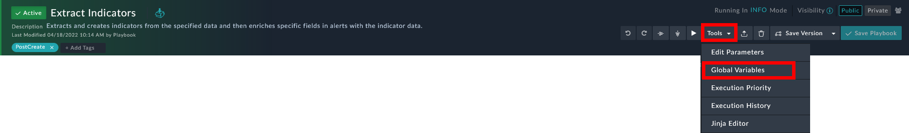
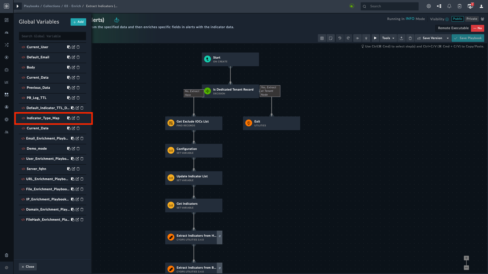

# Extending Default Indicator Extraction Process

In FortiSOAR, the indicator extraction feature extracts indicators from incident fields and enriches them using playbooks defined for the indicator type. In the indicator extraction, you can configure the extraction logic according to the incident type and the associated field.

We recommend that you optimize the indicator extraction process and define extraction settings for each incident type as needed.

FortiSOAR has automated the indicator extraction process through sets of playbooks; however, you can enhance the indicator extraction process by adding more fields of interest to a playbook so that it picks more fields apart from the default ones specified in the playbook.

E.g., the default playbook may not collect a field of interest, say “targeted employee email address”. This field of interest must be a part of the alert that we intend to target. To add a field to the alert, refer to the section [Extending Default Alert Schema](#extending-default-alert-schema).

You can extend the indicator extraction by modifying **Indicator Type Map Global** Variable.

Navigate to **Automation** > **Playbooks** > **03 – Enrich** > **Extract Indicator Playbook**.

> Refer to the playbooks section in this document to check the [playbook collection](#playbook-collection) included with this Solution Pack.

Navigate to **Automation** > **Playbooks** and click any playbook collection. A list of included playbooks appears on the left. Click any playbook and go to **Tools** > **Global Variables**.

From the Global variables on the left, click the edit button on `Indicator_Type_Map` to edit it.

Following is the default JSON contained in **Field Value** of the `Indicator_Type_Map` global variable. The key-value pairs are in the format `<FieldAPIKey>:<FieldType>`

    {
    "attachmentNames": "File",
    "commandLine": "Process",
    "computerName": "Host",
    "decodedCommandLine": "Process",
    "destinationIp": "IP Address",
    "destinationPort": "Port",
    "domain": "Domain",
    "dllLoaded": "Process",
    "emailFrom": "Email Address",
    "emailCc": "Email Address",
    "emailTo": "Email Address",
    "fileHash": "FileHash-MD5",
    "parentProcessCmdLine": "Process",
    "parentProcessName": "Process",
    "recipientEmailAddress": "Email Address",
    "registryKey": "Registry",
    "registryKeyValue": "Registry",
    "reporter": "Email Address",
    "returnPath": "Email Address",
    "senderDomain": "Domain",
    "senderEmailAddress": "Email Address",
    "services": "Process",
    "sourceIp": "IP Address",
    "sourcePort": "Port",
    "sourceProcess": "Process",
    "targetAsset": "Host",
    "targetProcess": "Process",
    "url": "URL",
    "userName": "User",
    "userDetails": "User",
    "urlFull": "URL",
    "otherRecipients": "Email Address"
    }

When you [add a new field to the alert schema](#extending-default-alert-schema), you specify a **Field Type** and – based on your field name – get a **Field API Key** name. 

As an example, let us add a field **Targeted Employee Email Address**, with a field API key `targetedEmployeeEmailAddress` and the **Field Type** as `Email Field`.

Enter the Field API Key and the Field Type in JSON’skey-value pair format in the box labeled **Field Value**. Click **Submit** to save the changes and **Save Playbook** to publish them.

> The key value pair for the JSON is `"targetedEmployeeEmailAddress": "Email Address"`.

After adding the above key-value pair, the JSON you need to enter in the **Field Value** of `Indicator_Type_Map` is:

    {
    "attachmentNames": "File",
    "commandLine": "Process",
    "computerName": "Host",
    "decodedCommandLine": "Process",
    "destinationIp": "IP Address",
    "destinationPort": "Port",
    "domain": "Domain",
    "dllLoaded": "Process",
    "emailFrom": "Email Address",
    "emailCc": "Email Address",
    "emailTo": "Email Address",
    "fileHash": "FileHash-MD5",
    "parentProcessCmdLine": "Process",
    "parentProcessName": "Process",
    "recipientEmailAddress": "Email Address",
    "registryKey": "Registry",
    "registryKeyValue": "Registry",
    "reporter": "Email Address",
    "returnPath": "Email Address",
    "senderDomain": "Domain",
    "senderEmailAddress": "Email Address",
    "services": "Process",
    "sourceIp": "IP Address",
    "sourcePort": "Port",
    "sourceProcess": "Process",
    "targetAsset": "Host",
    "targetProcess": "Process",
    "url": "URL",
    "userName": "User",
    "userDetails": "User",
    "urlFull": "URL",
    "otherRecipients": "Email Address",
    "targetedEmployeeEmailAddress": "Email Address"
    }

Now your playbook captures indicators corresponding to the **Targeted Employee Email Address** field.