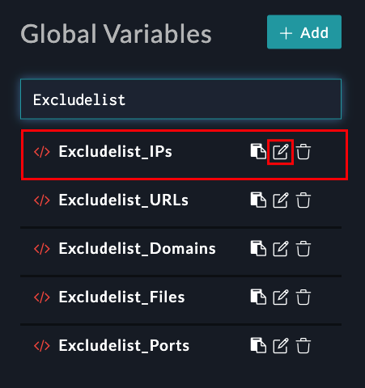
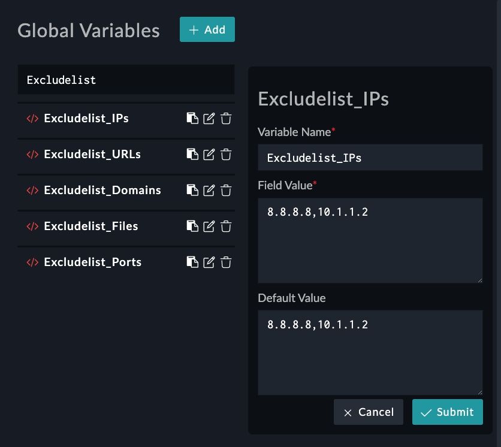

| [Home](../README.md) |
|----------------------|

# Extending Default Indicator Extraction Process

In FortiSOAR, the indicator extraction feature extracts indicators from incident fields and enriches them using playbooks defined for the indicator type. In the indicator extraction, you can configure the extraction logic according to the incident type and the associated field.

We recommend that you optimize the indicator extraction process and define extraction settings for each incident type as needed.

FortiSOAR has automated the indicator extraction process through sets of playbooks; however, you can enhance the indicator extraction process by adding more fields of interest to a playbook so that it picks more fields apart from the default ones specified in the playbook.

E.g., the default playbook may not collect a field of interest, say “targeted employee email address”. This field of interest must be a part of the alert that we intend to target. To add a field to the alert, refer to the section [Extending Default Alert Schema](./extending-default-alert-schema.md).

## Extending Default Alert Schema

You can extend the indicator extraction by modifying `Indicator_Type_Map` global variable.

Navigate to **Automation** > **Playbooks** > **03 - Enrich** > **Extract Indicator Playbook**.

> Refer to the playbooks section in this document to check the [playbook collection](./contents.md#playbook-collection) included with this Solution Pack.

Navigate to **Automation** > **Playbooks** and click any playbook collection. A list of included playbooks appears on the left. Click any playbook and go to **Tools** > **Global Variables**.


From the Global variables on the left, click the edit button on `Indicator_Type_Map` to edit it.


Following is the default JSON contained in **Field Value** of the `Indicator_Type_Map` global variable. The key-value pairs are in the format `<FieldAPIKey>:<FieldType>`

```JSON
{
    "attachmentNames": "File",
    "commandLine": "Process",
    "computerName": "Host",
    "decodedCommandLine": "Process",
    "destinationIp": "IP Address",
    "destinationPort": "Port",
    "domain": "Domain",
    "dllLoaded": "Process",
    "emailFrom": "Email Address",
    "emailCc": "Email Address",
    "emailTo": "Email Address",
    "fileHash": "FileHash-MD5",
    "parentProcessCmdLine": "Process",
    "parentProcessName": "Process",
    "recipientEmailAddress": "Email Address",
    "registryKey": "Registry",
    "registryKeyValue": "Registry",
    "reporter": "Email Address",
    "returnPath": "Email Address",
    "senderDomain": "Domain",
    "senderEmailAddress": "Email Address",
    "services": "Process",
    "sourceIp": "IP Address",
    "sourcePort": "Port",
    "sourceProcess": "Process",
    "targetAsset": "Host",
    "targetProcess": "Process",
    "url": "URL",
    "userName": "User",
    "userDetails": "User",
    "urlFull": "URL",
    "otherRecipients": "Email Address"
}
```

When you [add a new field to the alert schema](./extending-default-alert-schema.md), you specify a **Field Type** and – based on your field name – get a **Field API Key** name. 

As an example, let us add a field **Targeted Employee Email Address**, with a field API key `targetedEmployeeEmailAddress` and the **Field Type** as `Email Field`.

Enter the Field API Key and the Field Type in JSON’s key-value pair format in the box labeled **Field Value**. Click **Submit** to save the changes and **Save Playbook** to publish them.

> The key value pair for the JSON is `"targetedEmployeeEmailAddress": "Email Address"`.

After adding the above key-value pair, the JSON you need to enter in the **Field Value** of `Indicator_Type_Map` is:

```JSON
{
    "attachmentNames": "File",
    "commandLine": "Process",
    "computerName": "Host",
    "decodedCommandLine": "Process",
    "destinationIp": "IP Address",
    "destinationPort": "Port",
    "domain": "Domain",
    "dllLoaded": "Process",
    "emailFrom": "Email Address",
    "emailCc": "Email Address",
    "emailTo": "Email Address",
    "fileHash": "FileHash-MD5",
    "parentProcessCmdLine": "Process",
    "parentProcessName": "Process",
    "recipientEmailAddress": "Email Address",
    "registryKey": "Registry",
    "registryKeyValue": "Registry",
    "reporter": "Email Address",
    "returnPath": "Email Address",
    "senderDomain": "Domain",
    "senderEmailAddress": "Email Address",
    "services": "Process",
    "sourceIp": "IP Address",
    "sourcePort": "Port",
    "sourceProcess": "Process",
    "targetAsset": "Host",
    "targetProcess": "Process",
    "url": "URL",
    "userName": "User",
    "userDetails": "User",
    "urlFull": "URL",
    "otherRecipients": "Email Address",
    "targetedEmployeeEmailAddress": "Email Address"
}
```

Now your playbook captures indicators corresponding to the **Targeted Employee Email Address** field.

## Excluding Extracted Indicators from Enrichment

You can exclude certain extracted indicators from enrichment by adding them to an exclude list. This is done by adding the indicators being allowed to a global variable. Following are the global variables for each indicator type being allowed:

1. `Excludelist_IPs`: Specify comma-separated **IP addresses** to exclude

2. `Excludelist_URLs`: Specify comma-separated **URLs** to exclude

3. `Excludelist_Domains`: Specify comma-separated **Domains** to exclude

4. `Excludelist_Files`: Specify comma-separated **File Names** or **File Extensions** to exclude

5. `Excludelist_Ports`: Specify comma-separated **Ports** to exclude

<table>
    <tr>
        <th>NOTE</th>
        <td>For managing and modifying global variables, refer to the section <a href="https://docs.fortinet.com/document/fortisoar/7.2.0/playbooks-guide/488685/dynamic-values#Global_Variables" target="_blank"><strong>Global Variables</strong></a> of the <strong>Playbooks Guide</strong> in <strong>FortiSOAR documentation</strong>.</td>
    </tr>
</table>

1. Click **Global Variables** from the **Tools** menu.

    

2. Click the edit button  to edit a relevant exclude list. You can type **`exclude`** in the search bar (highlighted) to narrow-down the list of global variables.

    

3. Enter comma-separated indicators to add in the **Field Value** of the selected global variable. Following image shows the `Excludelist_IPs` global variable and its contents.

    

Following are the exclude list values out-of-the-box with the SOAR Framework solution pack:

<table>
    <thead>
        <tr>
            <th>Global Variable</th>
            <th>Default Field Value</th>
        </tr>
    </thead>
    <tbody>
        <tr>
            <td><code>Excludelist_IPs</code></td>
            <td><code>8.8.8.8, 10.1.1.2</code></td>
        </tr>
        <tr>
            <td><code>Excludelist_URLs</code></td>
            <td><code>https://www.google.com, https://mail.yahoo.com/login.html, https://www.office.com/</code></td>
        </tr>
        <tr>
            <td><code>Excludelist_Domains</code></td>
            <td><code>google.com, yahoo.com, fortinet.net, gmail.com, outlook.com, microsoft.com,</code><br/>
            <code>fortinet.com, twitter.com, facebook.com, linkedin.com, instagram.com, fortiguard.com,</code><br/>
            <code>forticloud.com, w3.org</code></td>
        </tr>
        <tr>
            <td><code>Excludelist_Files</code></td>
            <td>blank</td>
        </tr>
        <tr>
            <td><code>Excludelist_Ports</code></td>
            <td>blank</td>
        </tr>
    </tbody>
</table>

### Adding Comment to Excluded File Alerts

You can choose to add a comment to alerts associated with the excluded files. By default, no comments are added to alerts associated with these files.

1. Open the **Configuration** step of the playbook **Extract indicators** in the collection **03- Enrich**.

2. Edit the variable `add_excluded_file_comment` and set it to `true`.

    This results in execution of the last step `Add Comment for Excluded Files` and a comment is added to the alert *when a file is skipped from the indicator creation process*.

    You can change the content of the comment by editing the **Content** field of the `Add Comment for Excluded Files` step.

### Skip Creating File Indicators

You can choose to skip creating file indicators entirely so the indicators of type *file* are never created.

1. Open the **Configuration** step of the playbook **Extract indicators** in the collection **03- Enrich**.

2. Edit the variable `create_file_iocs` and set it to `false`.

    This results in file indicators not being created at all.

## Recommended/Advanced settings

When the Exchange connector playbooks create attachment records in the **Attachments** module for each file attachment in the email, they remove all special characters in the filename except `-`, `\`, and `.`. So a file indicator is created for files that may contain other characters in their names, even if they are in the exclude list.

<table>
    <tr>
        <th>Example</th>
        <td>A filename <code>Demo-File_Attachment.txt</code> in the exclude list has no effect as the underscore (<code>_</code>) is suppressed and a file indicator with the filename <code>Demo-FileAttachment.txt</code> is still created.</td>
    </tr>
</table>

Here are 2 possible ways to work around this situation:

1. Avoid using characters other than `-`, `\`, and `.` when adding filenames in the exclude list. For example, add the filename `Demo-FileAttachment.txt` instead of `Demo-File_Attachment.txt`, as the underscore (`_`) is suppressed by the Exchange ingestion playbooks.

2. Edit the `Upload File IOC and Create Attachment` step of the **> Exchange > Create Indicators and Attachments** playbook in the **Sample - Exchange - [version]** collection and modify the regex so that it does not suppress `_` or similar harmless characters in filenames.

    Remove the following:

    ```
    "{{vars.input.params.attachmentMetadata.metadata.filename.split("/")[-1] | regex_replace("[^A-Za-z0-9. /\-]", "") if "/tmp/" in vars.input.params.attachmentMetadata.metadata.filename else vars.input.params.attachmentMetadata.metadata.filename |regex_replace("[^A-Za-z0-9. /\-]", "")}}"
    ```

    Replace with the following:

    ```
    "{{vars.input.params.attachmentMetadata.metadata.filename.split("/")[-1] | regex_replace("[^A-Za-z0-9. /\-_]", "") if "/tmp/" in vars.input.params.attachmentMetadata.metadata.filename else vars.input.params.attachmentMetadata.metadata.filename |regex_replace("[^A-Za-z0-9. /\-_]", "")}}"
    ```

| [Installation](./setup.md#installation) | [Configuration](./setup.md#configuration) | [Usage](./usage.md) | [Contents](./contents.md) |
|-----------------------------------------|-------------------------------------------|---------------------|---------------------------|
