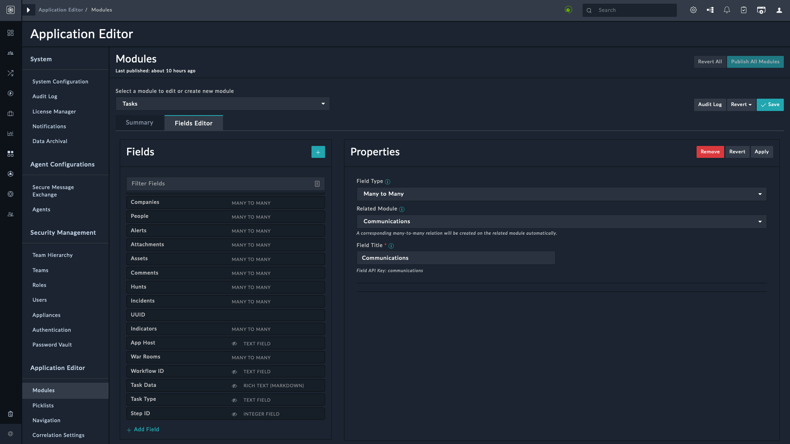
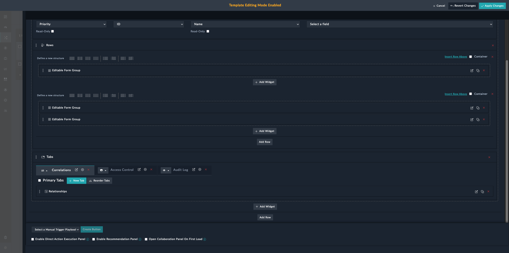
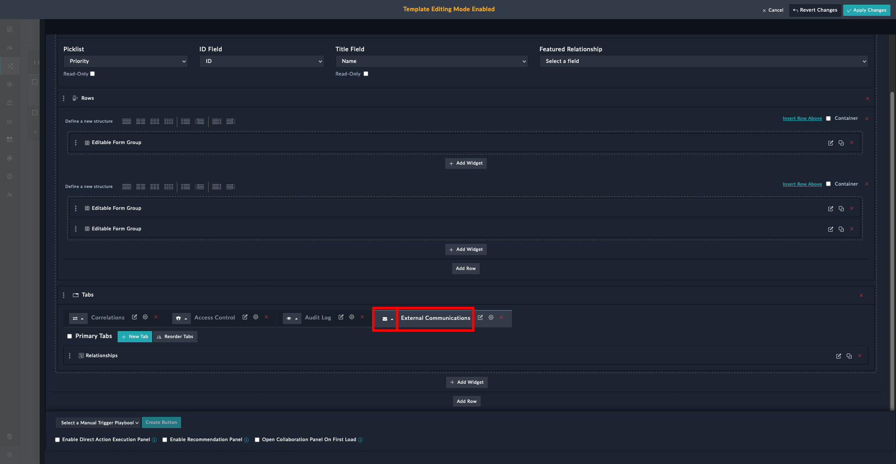
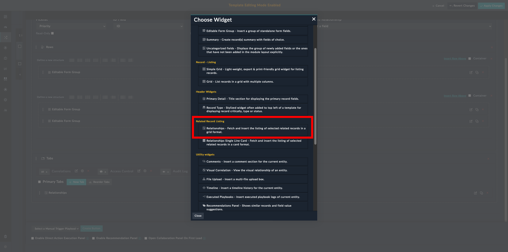
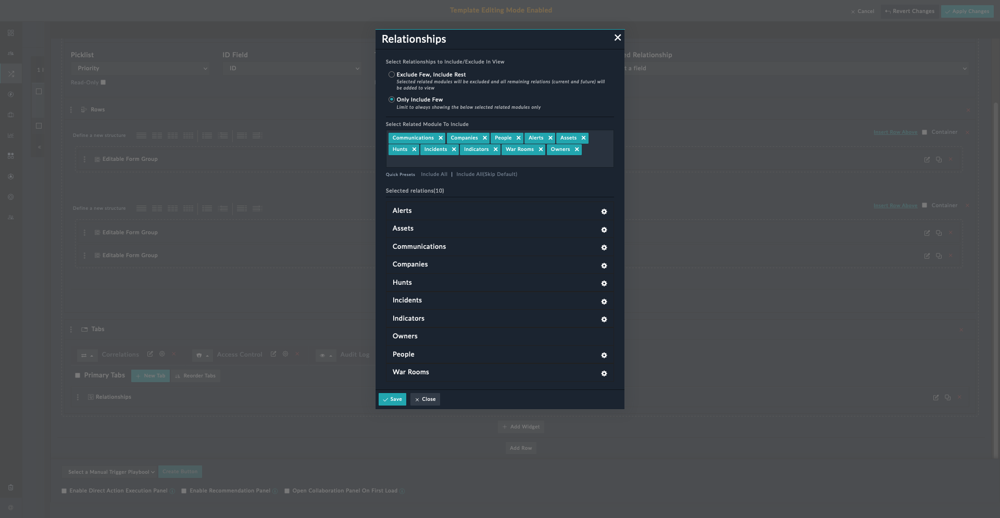

| [Home](../README.md) |
|----------------------|

# Setting up Communications Tracking for Custom Modules

Communications Tracking in SOAR Framework Solution Pack helps teams keep track of all communication related to modules such as an alert, incident, indicator, or a task. The **Communications** tab in these modules lists all the email communication that was sent from, and received in, FortiSOAR.

By default, communications tracking is already set up for Alerts and Incidents. The subsequent sections help set up Communications tracking for other modules.

## Prerequisites

An email ingestion process to periodically read email from a designated inbox and establish communication with other users regarding an alert, incident, indicator, or a task.
  - To configure and use the Microsoft Exchange connector for email ingestion, refer to [Configuring Exchange Connector](https://docs.fortinet.com/document/fortisoar/3.4.0/exchange/1/exchange-v3-4-0#Configuring_the_connector)
  - To configure and use the IMAP connector for email ingestion, refer to [Configuring IMAP Connector](https://docs.fortinet.com/document/fortisoar/3.5.6/imap-connector/326/imap-connector-v3-5-6)
  - To configure and use the SMTP connector for sending emails, refer to [Configuring SMTP Connector](https://docs.fortinet.com/document/fortisoar/2.4.3/smtp-connector/327/smtp-connector-v2-4-3)

## Configurations

To track any communication related to modules, you need to add the **Communications** field to those modules. Once added, each of these module's System View Template should then be edited to display a communications tab that tracks all communication related to any alert, incident, indicator, or a task.

### Adding Communications to Modules

1. Log in to FortiSOAR.
2. Open the module editor by clicking **Settings** and in the *Application Editor* section, click **Modules**. This displays the **Modules** page.
3. Select a module from Alerts, Incidents, Indicators, or Tasks. For the purposes of this documentation, we have chosen **Tasks**.
4. Select **Fields Editor** tab.
5. Click  to add a field. Following interface appears:

    

6. Enter the following details:
    - **Field Type**: *Many to Many*
    - **Related Module**: *Communications*
    - **Field Title**: *Communications*
7. Click **Save** to save the changes to the module.
8. Click **Publish All Modules** to apply the changes.

### Editing the System View Template

The field is now linked to the module, however, we need to add a tab in the module's &mdash; *Tasks* in our case &mdash; System View Template. The System View Template that we need to edit is that of a record, and not the module.

1. From the **Incident Response** menu, select **Tasks**.
2. Click to open a task.

    >**NOTE**: If there are no tasks listed in the **Tasks** module, you can create a sample task just so that you have a record to edit its System View Template.

3. Click  from the upper-right corner. Scroll down to find **Tabs**.

    

4. Click the button **+ New Tab** and enter a name for the tab and choose an icon. We have used *External Communications* as the tab name. Click  to save the tab's name. Choose an icon from the drop-down.

    

5. Click **+ Add Widget** under the tab and choose **Relationships** under the **Related Record Listing** section.

    

6. Click  to edit the **Relationships** widget and bring up the following interface.

    

7. Select the option **Only Include Few** and ensure that **Communications** pill is present in the **Select Related Module To Include** field.

    >**NOTE**: You can type to search and select the related module to include.

8. Click **Save** to save the changes made to the **Relationships** modal.
9. Click **Apply Changes** from the upper-right corner. Click **Confirm** when prompted.

The sample Tasks record that you created now has a new tab **External Communications**.

### Updating Communication Tracking Playbooks for Custom Modules

As an example, we explain how to configure communication tracking playbooks for the **Tasks** module.

1. Navigate to **Automation** > **Playbooks**.
2. Click to open **06 - IRP - Communications Tracking** playbook collection.
3. Click to open **Add Note for Communication Linked (Received)** playbook.
    1. Double-click to edit the **Configuration** step.
    2. Click **+ Add More** to add a new variable.
    3. Specify the name of the variable. For example `taskIRI`. The corresponding Jinja expression is `{{vars.data.tasks[0][‘@id’]}}`.
    4. Click **Save** to save the changes made to the step.
    5. Double-click to open the **Add Note** step.
    6. Under **Fields**, click the tab **Correlations**.
    7. Add the task IRI to the **Task** field. The corresponding Jinja expression is `[“{{vars.taskIRI}}”]`.
    8. Click **Save** to save the changes made to the step.
4. Click to open **Add Note for Communication Linked** playbook.
    1. Double-click to open the **Add Note** step.
    2. Under **Fields**, click the tab **Correlations**.
    3. Add the task IRI to the **Task** field. The corresponding Jinja expression is `[“{{vars.data.tasks[0][‘@id’]}}”]`.
    4. Click **Save** to save the changes made to the step.
5. Create **Create Communication Record (Task)** Playbook.
    1. Click the checkbox to select **Create Communication Record (Alert)** playbook.
    2. Click **Clone** to create a copy of **Create Communication Record (Alert)** playbook.
    3. Double-click to open the cloned playbook &mdash; **Create Communication Record (Alert) (1)**.
    4. Click the playbook title on the top to rename the cloned playbook. Change the name to **Create Communication Record (Task)**.
    5. Double click to open the **Start** step.
    6. Under **Execution Behavior**, change the value in **Choose record modules on which the playbook would be available on** field from **Alerts** to **Tasks**.
    
Now, the **Tasks** module has a tab **External Communications** and tracks any communication sent from, and received in, FortiSOAR.

| [Installation](./setup.md#installation) | [Configuration](./setup.md#configuration) | [Usage](./usage.md) | [Contents](./contents.md) |
|-----------------------------------------|-------------------------------------------|---------------------|---------------------------|