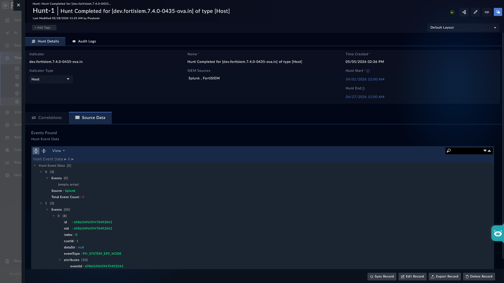

| [Home](../README.md) |
|----------------------|

# Setting up Default Hunt Playbook

Threat hunt focusses on detecting threats as early as possible to minimize the impact of a breach. Using threat hunting playbooks, you can not only hunt for indicators in real time, but can also perform retrospective detection to determine if the organization was in fact compromised in the past and, if so, immediately launch the case response process.

With the new *Pluggable* hunt in place, the hunting process is now faster and more optimized. We recommend using it to augment or enhance your indicator hunt process.

>[!NOTE]
>
>*Pluggable* enrichment is available for the following connectors only:
>- FortiSIEM
>- Splunk
>

## Using Pluggable Indicator Hunting Framework

The *Pluggable* Indicator Hunting framework is designed to integrate various SIEM integrations, such as FortiSIEM, Splunk, for efficient Indicator hunting. *Pluggable* Indicator Hunt process uses the playbooks contained within installed connectors to hunt an indicator.

This hunt process is triggered when an a hunt record is created or via a manual trigger **Hunt Indicators** on an indicator record.

>[!NOTE]
>
>The hunt process triggers automatically on creation of a hunt record **only** if Threat Intel Management solution pack is installed.
>

### Understanding the Hunt Process

Upon triggering, the playbook **Hunt Indicators (Type All)** executes and puts the following sequence in motion:

1. **Search Tagged Playbooks**: The playbook *Hunt Indicators (Type All)* searches for installed connector playbooks with specific tags using the playbook **Update/Initialize Indicator Enrichment Global Variables**. For example

   - If the indicator is of the type *URL*, this playbook looks for the tag `URL_Hunt`

   - For indicators of type *IP Address* it looks for the tag `IP_Hunt`

   - For indicators of type *File Hash* it looks for the tag `FileHash_Hunt`

2. **Configuration Check**: Once the playbooks with appropriate tags are identified, the playbook *Update/Initialize Indicator Enrichment Global Variables* checks if the corresponding connectors are configured. For this purpose, it runs the playbook **Retrieve Configured Enrichment Connectors**.

3. **Check Playbook IRI Global Variable**: If the connectors are configured, the playbook *Update/Initialize Indicator Enrichment Global Variables* checks the global variables &ndash; in the format *`<indicator type>`*`_Hunt_Playbooks_IRIs` &ndash; containing the associated playbooks IRI, and creates the variable if not found.

    For example, for indicator of type *URL* it checks for the global variable `URL_Hunt_Playbooks_IRIs` and creates the global variable when not found.

4. **Update Playbook IRI**: The playbook *Update/Initialize Indicator Enrichment Global Variables* adds the associated playbook IRIs to the corresponding global variable.

    For example, the IRIs of playbooks tagged with `URL_Hunt`, are added to the global variable `URL_Hunt_Playbooks_IRIs`.

5. **Add/Remove Existing Playbook IRIs**: In a situation when user adds new/custom hunt playbook or remove/inactivate the  existing hunt playbooks from the sample collection then it is required to reset the hunt global variable by executing the `Reset Hunt Global Variables` playbook in *05-Hunt* collection. 

### Starting a Hunt by Manual trigger on Indicator record

Hunt can be triggered manually on an indicator record by

1. Select the indicator and click <picture><source media="(prefers-color-scheme: dark)" srcset="./res/icon-playbooks-light.svg"><source media="(prefers-color-scheme: light)" srcset="./res/icon-playbooks-dark.svg"></picture> **Execute** <picture><source media="(prefers-color-scheme: dark)" srcset="./res/icon-chevron-light.svg"><source media="(prefers-color-scheme: light)" srcset="./res/icon-chevron-dark.svg"></picture> **Hunt Indicators** *05 - Hunt*

2. This action executes the playbook **Indicator (Manual Trigger) - Initiate IOC Hunt**

3. The user has to provide a hunt start and end time range.

   Using this time range a hunt query runs through configured connectors and to display results.

4. Once the time range is selected, the playbook **Hunt Indicators (Type All)** executes the associated connector's enrichment playbooks, which in turn returns the following hunt information:

   - **Events**: Hunted events to be fetched, this value is retrieved from the **Key Store** record `pluggable-IOCs-hunt-parameters`

   - **Source**: SIEM source name, for example, FortiSIEM

   - **Total Event Count**: Total events found when hunt query ran on the SIEM platform

A Hunt record is created under <picture><source media="(prefers-color-scheme: dark)" srcset="./res/icon-threat-intel-management-light.svg"><source media="(prefers-color-scheme: light)" srcset="./res/icon-threat-intel-management-dark.svg"></picture> **Threat Intelligence** <picture><source media="(prefers-color-scheme: dark)" srcset="./res/icon-chevron-light.svg"><source media="(prefers-color-scheme: light)" srcset="./res/icon-chevron-dark.svg"></picture> <picture><source media="(prefers-color-scheme: dark)" srcset="./res/icon-space-shuttle-light.svg"><source media="(prefers-color-scheme: light)" srcset="./res/icon-space-shuttle-dark.svg"></picture> **Hunts**.

The Hunt Summary is stored in the *Source Data* tab of that hunt record's detailed view.



### Using Key Store to store SIEM-specific configurations

Users can configure SIEM-specific query parameters while querying/hunting. For this they can use the key: `pluggable-IOCs-hunt-parameters`

For example, the key `splunk`, within the **Key Store** record `pluggable-IOCs-hunt-parameters`, stores the following information as a JSON object:

```json
"index": "main",
"maxEventsToFetch": 10
```

## Additional Information

1. **Saving Indicator Hunt Playbooks**

   - All action playbooks created for indicator hunt must be saved in respective connector's sample playbook collection.

   - *05-Hunt* collection serves as a repository for all hunting playbooks, ensuring that they are organized and easily accessible.

> [!NOTE]
> 
> The *`05-Hunt`* playbook collection is a part of **SOAR Framework** solution pack.
> 

2. **Tagging Threat Hunting Playbooks**

   Each indicator hunt playbook must be tagged with a specific identifier to facilitate its retrieval and execution. The tagging convention follows the format `[<IOC Type>_Hunt]`. For example, both FortiSIEM and Splunk have the following IoC hunt playbook tags:

   - `Domain_Hunt`
   - `Email_Hunt`
   - `FileHash_Hunt`
   - `Host_Hunt`
   - `IP_Hunt`
   - `Process_Hunt`
   - `URL_Hunt`
   - `User_Hunt`

## Next Steps

| [Installation](./setup.md#installation) | [Configuration](./setup.md#configuration) | [Usage](./usage.md) | [Contents](./contents.md) |
|-----------------------------------------|-------------------------------------------|---------------------|---------------------------|
