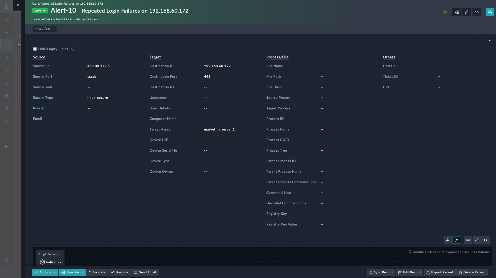

| [Home](./README.md) |
|---------------------|

# What's New

<table>
    <tr>
        <th>Compatible Version</th>
        <td>FortiSOAR v7.4.1 and later</td>
    </tr>
</table>

<table>
    <tr>
        <th>NOTE</th>
        <td>Before updating the SOAR Framework solution pack, make sure to back up any modifications you have made to <strong>System View Templates (SVTs)</strong>, <strong>Module Metadata (MMD)</strong>, and <strong>playbooks</strong>. This is essential because updating the solution pack overwrites any changes you might have made.</td>
    </tr>
</table>

## Playbook Enhancements

- Added a new playbook **Extract Indicators - Create File Indicator**, in the *03 - Enrich* playbook collection that creates indicators of type **`File`**. It extracts these indicators from suspicious email attachments and creates them in FortiSOAR&trade; in the following format:

    `File - FileName - MD5FileHash`

- Enhanced the **Extract Indicators** playbook in the *03 - Enrich* playbook collection with the following changes:

    - Does not create indicators for file names and extensions specified in the global variable `Excludelist_Files`

        - The global variable is empty, by default
        - Values provided in this global variable are case-sensitive

    - Does not create indicators for ports specified in the global variable `Excludelist_Ports`

        - The global variable is empty, by default

        For more information, refer to the section [Excluding Extracted Indicators from Enrichment](./docs/extending-default-indicator-extraction-process.md#excluding-extracted-indicators-from-enrichment)

- The **Find and Relate Similar Alerts** playbook in the *03 - Triage* collection now finds alerts for the last 30 days. In the MSSP environment, it finds alerts that belong to the tenant on which the playbook is being executed.

- The **Flag Indicators Linked Across Multiple Alerts** playbook in the *03 - Triage* collection now flags only those alerts that were generated in the last 30 days.

- The **Create Communication Record (Email Reply)** playbook in the *06 - IRP - Communications Tracking* collection now handles email replies without the encrypted text in the body> It adds a comment in the alert instead of failing a playbook.

- The **Create and Link Asset** playbook in the *08 - Utilities* collection now ensures accurate labels in alignment with the flow by fixing the branch tooltips for the `Do Records Exist` decision step.


## Module Enhancements

- The default value for **`Team Ownable`** is now `false` in all modules.

    Select the **Team Ownable** field, i.e. set it to `true`, in the module editor when running playbooks that fetch module owners. 
    
    >For example, in a War Room, **_before_** running the playbook that notifies the War room owner, like **_Go Live_** and **_Send Email Update_**, enable the **Team Ownable** and **User Ownable** fields to avoid playbook failure.

    <table>
        <tr>
            <th>NOTE </th>
            <td>This change won't affect FortiSOAR&trade; instances with upgraded SOAR Framework; it only applies to newly deployed instances, where users manually set <strong><code>Team Ownable</code></strong>, as needed, for each module.</td>
        </tr>
    </table>

### Alerts

- Added a new **`Ticket ID`** field that is visible only when the field value is not `null`.

- Replaced the *Editable Form Group* widget with the **Fields of Interest** widget in an alert's detailed view to better display the alert's details. The following screenshot displays the Fields of Interest widget (with empty values for representational purposes).



### Assets

- Introduced a new `BES Cyber Asset Category` field and a picklist that becomes visible only when the field value is **_not set_**.

- Rearranged the Asset List View columns in the following order:
   1. ID
   2. Display Name
   3. Hostname
   4. MAC Address
   5. IP Address
   6. Device UUID
   7. Vendor
   8. Product
   9. Category
   10. Asset Criticality
   11. Asset State
   12. Asset Status
   13. Asset Risk
   14. Asset Registration Date
   15. Last Scanned On
   16. Property Of

### Incidents
- Added the **Technique ID** field to the detailed view of the Incident that does not become visible when the field value is **`null`**.

- Introduced a new **Ticket ID** field that does not become visible when the field value is **`null`**.

### Indicators

- Marked the following indicator module fields replicable by default from the tenant node in an MSSP environment:

    - TLP
    - Expired
    - Expired On

### Key Store

- Introduced new fields named `JSON Value` and `Notes`

### SLA Templates

- Updated the field types of the following fields from **`picklist`** to **`multipicklist`**. This is available on a new installation of SOAR Framework solution pack `v2.2.1`. For users **_upgrading_** to `v2.2.1`, these fields remain a regular picklist:

    - Pause Incident SLA On
    - Pause Alert SLA On

        Users can now set multiple *Pause SLA On* statuses

    - The detailed view of the SLA template module has also been updated accordingly.

## Dashboard Enhancements

-  Updated the **Analyst** dashboard's *Critical Alerts* tab to display only *High* and *Critical* severity alerts.

## Rules Enhancements

- **_Notification On Pending Internal Manual Input_**: Created a rule that sends email notifications to FortiSOAR users. When creating manual input for internal users, select the option to customize the email body to send this email notification.

## Roles Enhancement 

- Added a new **Read-Only User** role that only has viewing rights. This role has does not have any editing or modification rights.

## Performance Enhancement

- Links indicators to alerts by updating the alert record instead of during indicator creation for increased performance

- The **Create and Link Asset** playbook has enhanced the overall functionality by optimizing the record correlation logic.

- Enhanced the **_Approval-Based Decision_** reference block by replacing the old approval step with a new step to improve performance.

## Known Issue

When the Exchange connector playbooks create attachment records in the **Attachments** module for each file attachment in the email, they remove all special characters in the filename except `-`, `\`, and `.`. So a file indicator is created for files that may contain other characters in their names, even if they are in the exclude list.

<table>
    <tr>
        <th>Example</th>
        <td>A filename <code>Demo-File_Attachment.txt</code> in the exclude list has no effect as the underscore (<code>_</code>) is suppressed and a file indicator with the filename <code>Demo-FileAttachment.txt</code> is still created.</td>
    </tr>
</table>

### Workaround

Here are 2 possible workarounds to avoid this scenario:

1. Avoid using characters other than `-`, `\`, and `.` when adding filenames in the exclude list. For example, add the filename `Demo-FileAttachment.txt` instead of `Demo-File_Attachment.txt`, as the underscore (`_`) is suppressed by the Exchange ingestion playbooks.

2. Edit the `Upload File IOC and Create Attachment` step of the **> Exchange > Create Indicators and Attachments** playbook in the **Sample - Exchange - 4.2.2** collection and modify the regex so that it does not suppress `_` or similar harmless characters in filenames.

    Remove the following:

    ```
    "{{vars.input.params.attachmentMetadata.metadata.filename.split("/")[-1] | regex_replace("[^A-Za-z0-9. /\-]", "") if "/tmp/" in vars.input.params.attachmentMetadata.metadata.filename else vars.input.params.attachmentMetadata.metadata.filename |regex_replace("[^A-Za-z0-9. /\-]", "")}}"
    ```

    Replace with the following:

    ```
    "{{vars.input.params.attachmentMetadata.metadata.filename.split("/")[-1] | regex_replace("[^A-Za-z0-9. /\-_]", "") if "/tmp/" in vars.input.params.attachmentMetadata.metadata.filename else vars.input.params.attachmentMetadata.metadata.filename |regex_replace("[^A-Za-z0-9. /\-_]", "")}}"
    ```